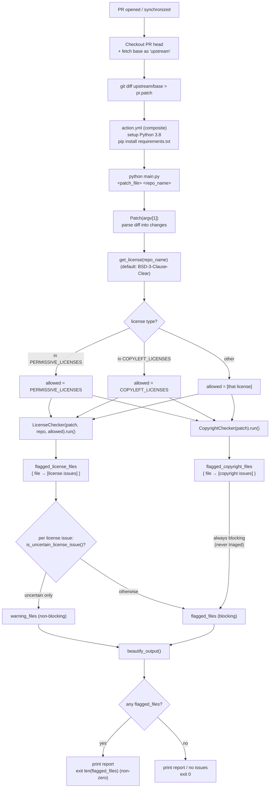

# Pull-Request Patch Scan — 

The patch scan ([`main.py`](../main.py)) inspects **only the commit diff** of a
pull request — the lines added and removed. 

It runs **two checks** on every PR:
- **License check** — do the added lines introduce an incompatible license?
  (allowed = **permissive** — MIT, BSD, Apache-2.0, ISC, Zlib… — for a permissive
  repo, or the **copyleft** family — GPL/LGPL/AGPL — for a copyleft repo; the
  repo's own license defaults to **`BSD-3-Clause-Clear`** when none is detected.)
- **Copyright check** — do the removed lines delete an existing copyright holder?
  (detected by regex on the diff: every `+`/`-` line containing the word
  `Copyright` is collected, normalized to letters-only, and a holder is flagged
  when it appears on a removed line but no re-added line — except the built-in
  **Qualcomm Innovation Center → Qualcomm Technologies, Inc.** rename.)

**How licenses are detected:** both checks use [scancode](https://github.com/nexB/scancode-toolkit)
(run as `scancode --license`). The added/deleted diff lines are written to temp
files and scanned in a **single** batch invocation, and scancode returns an SPDX
license expression (e.g. `MIT`, `Apache-2.0`, `MIT OR GPL-2.0-only`) per file.
The repo's own license is detected the same way — scancode runs over its
`LICENSE`/`COPYING` file. Copyright statements are found by regex on the diff
(`Copyright` lines), not by scancode.

Both checks always run; the PR is **blocked if *either* one finds a blocking issue**. 

It does *not* look at unchanged legacy files.

---

## 1. Overall flow

---
