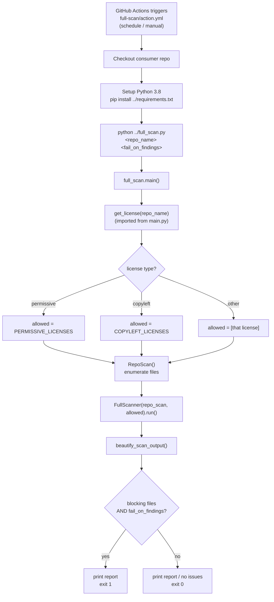
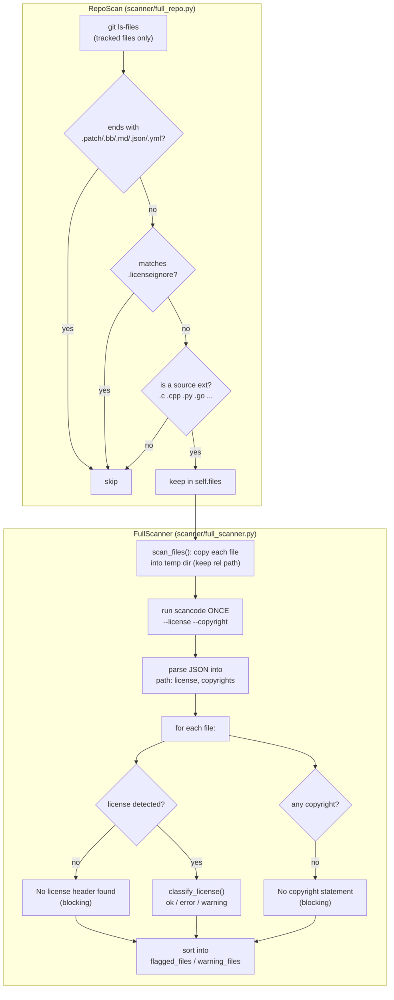
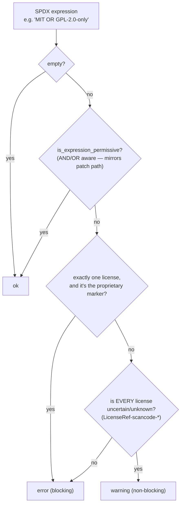

# Full-Repository Scan — Architecture & Flow

This document explains how the **full-repository scan** works and how it fits
alongside the existing pull-request patch scan.

> The diagrams below are [Mermaid](https://mermaid.js.org/). They render
> automatically on GitHub. To view locally, use the VSCode extension
> *"Markdown Preview Mermaid Support"* or paste a block into
> <https://mermaid.live>.

## Why it exists

The PR **patch scan** ([`main.py`](../main.py)) only inspects the commit diff of
a pull request — the lines added/removed. That means a repository onboarded
*after* it already has history never has its legacy files checked; only new PR
diffs are scanned.

The **full-repository scan** ([`full_scan.py`](../full_scan.py)) closes that gap:
it walks every tracked source file in the working tree and scans each file in
its entirety. It is a **separate entry point and separate action** — it does not
modify or share mutable state with the patch scan.

---

## 1. Overall flow

---

## 2. Inside `RepoScan` + `FullScanner.run()`

---

## 3. `classify_license()` decision logic

This mirrors `main.py`'s two-stage decision. Permissiveness is decided
**structurally** (AND/OR aware) first; only if that fails do we split
error-vs-warning on the flattened license list.

**Worked examples**

| SPDX expression | Result | Why |
|---|---|---|
| `BSD-3-Clause-Clear` | ok | permissive |
| `MIT OR GPL-2.0-only` | ok | OR group has a permissive option |
| `GPL-2.0-only` | error | concrete disallowed license |
| `proprietary-license AND BSD-3-Clause` | error | not permissive; concrete disallowed mixed in |
| `LicenseRef-scancode-unknown` | warning | only uncertain/unknown licenses |

---

## Checks performed per file

| Check | Condition | Severity |
|---|---|---|
| Missing license header | no license detected | blocking |
| Incompatible license | detected license not permitted for the repo | blocking |
| Missing copyright | no copyright statement in the file | blocking |
| Uncertain license | only `LicenseRef-scancode-unknown*` licenses | warning (non-blocking) |

## Exit behavior

`fail_on_findings` defaults to `false` (report-only, always exits `0`) so a
periodic scan of a legacy repository never unexpectedly breaks CI. Set it to
`true` to make blocking findings fail the run (exit `1`).

## Relationship to the patch scan

| | Patch scan | Full-repo scan |
|---|---|---|
| Entry point | `main.py` | `full_scan.py` |
| Action | `action.yml` | `full-scan/action.yml` |
| Input | a `.patch` diff (added/removed lines) | whole tracked files (`git ls-files`) |
| Purpose | gate a PR's changes | periodic audit + catch legacy files |
| Shared code | — | read-only license data imported from `main.py` |
