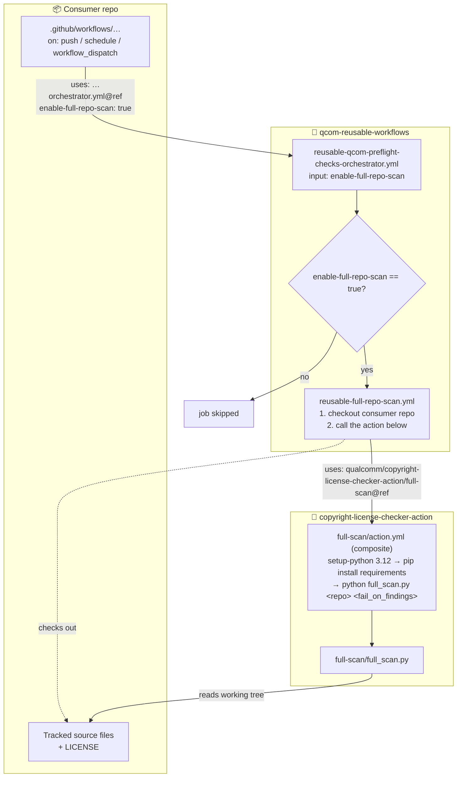
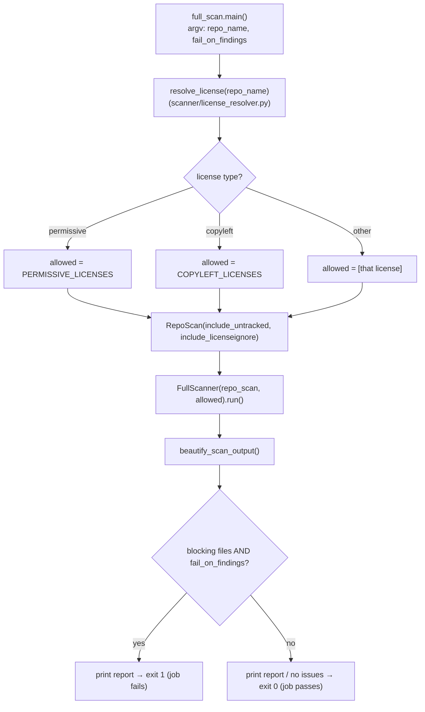
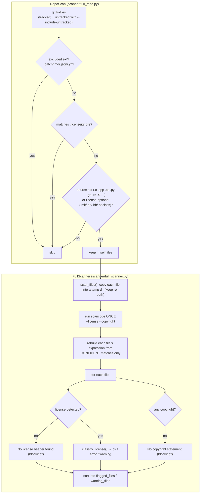
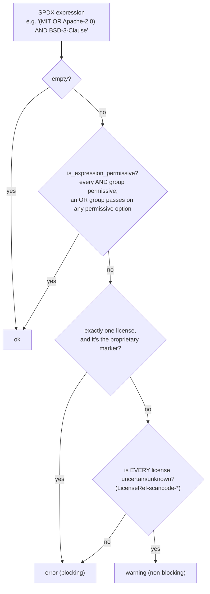

# Full-Repository Scan — Architecture & Flow

How the **full-repository scan** works, how a consumer repo triggers it, and how it fits
alongside the pull-request patch scan.

> The diagrams below are [Mermaid](https://mermaid.js.org/) and render automatically on
> GitHub. To view locally, use the VSCode extension *"Markdown Preview Mermaid Support"* or
> paste a block into <https://mermaid.live>.

## Why it exists

The PR **patch scan** (`main.py`, at the repo root) only inspects the commit diff of a pull
request — the lines added/removed. A repository onboarded *after* it already has history never
has its legacy files checked; only new PR diffs are scanned.

The **full-repository scan** (`full-scan/full_scan.py`) closes that gap: it walks every source
file in the working tree and scans each file in its entirety. By default it covers git-tracked
files; pass `--include-untracked` to also scan untracked-but-not-`.gitignore`d files. It is a
**separate entry point and separate action**, and is **fully self-contained** — it imports
nothing from the patch scan (it bundles its own license lists, config, and `.licenseignore`
matcher).

---

## 1. Cross-repo flow (how a consumer triggers it)

The action's steps run with the working directory set to the **consumer** checkout, so
`git ls-files` and license resolution (which read the current dir) see the consumer repo — not
this action's repo.

---

## 2. Inside `full_scan.py`

`resolve_license` resolves the repo's top-level license from its `LICENSE` file (falling back
to a per-project config map, then a `BSD-3-Clause-Clear` default). It deliberately distrusts
scancode's low-confidence `proprietary-license` catch-all on the LICENSE file — scancode
sometimes mis-detects a standard OSS LICENSE as proprietary, which would otherwise flag every
compliant file in the repo.

---

## 3. Inside `RepoScan` + `FullScanner.run()`

\* License-optional build files (`.mk`/`.bp`/`.bb`/`.bbclass`) are exempt from the
missing-header and missing-copyright checks; only an incompatible/uncertain license they
actually carry is reported.

---

## 4. `classify_license()` decision logic

Permissiveness is decided **structurally** (AND/OR aware) first; only if that fails do we split
error-vs-warning on the flattened license list.

**Worked examples**

| SPDX expression | Result | Why |
|---|---|---|
| `BSD-3-Clause-Clear` | ok | permissive |
| `MIT OR GPL-2.0-only` | ok | OR group has a permissive option |
| `(MIT OR Apache-2.0) AND GPL-2.0` | error | permissive OR group, but the trailing AND term is disallowed |
| `GPL-2.0-only` | error | concrete disallowed license |
| `LicenseRef-scancode-unknown` | warning | only uncertain/unknown licenses |

---

## Checks performed per file

| Check | Condition | Severity |
|---|---|---|
| Missing license header | no license detected | blocking |
| Incompatible license | detected license not permitted for the repo | blocking |
| Missing copyright | no copyright statement in the file | blocking |
| Unexpected copyright holder | holder doesn't match the expected Qualcomm/LF pattern | warning |
| Uncertain license | only `LicenseRef-scancode-*` (unknown) licenses | warning |

## Exit behavior

`fail_on_findings` defaults to `false` (report-only, always exits `0`) so a periodic scan of a
legacy repository never unexpectedly breaks CI. Set it to `true` to make blocking findings fail
the run (exit `1`).

## Relationship to the patch scan

| | Patch scan | Full-repo scan |
|---|---|---|
| Entry point | `main.py` (repo root) | `full-scan/full_scan.py` |
| Action | `action.yml` (repo root) | `full-scan/action.yml` |
| Input | a `.patch` diff (added/removed lines) | whole files (`git ls-files`; + untracked opt-in) |
| Purpose | gate a PR's changes | periodic audit + catch legacy files |
| Coupling | — | none — full-scan is fully self-contained |
